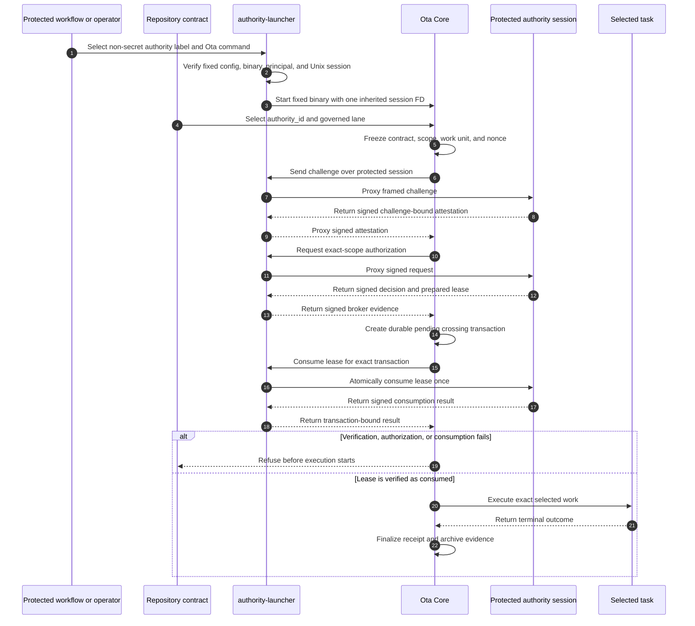

<!--
                █████
               ░░███
       ██████  ███████    ██████
      ███░░███░░░███░    ░░░░░███
     ░███ ░███  ░███      ███████
     ░███ ░███  ░███ ███ ███░░███
     ░░██████   ░░█████ ░░████████
      ░░░░░░     ░░░░░   ░░░░░░░░

   Copyright (C) 2026 — 2026, Ota. All Rights Reserved.

   Licensed under the Apache License, Version 2.0. See LICENSE for the full license text.
   You may not use this file except in compliance with that License.
   Unless required by applicable law or agreed to in writing, software distributed under the
   License is distributed on an "AS IS" BASIS, WITHOUT WARRANTIES OR CONDITIONS OF ANY KIND,
   either express or implied. See the License for the specific language governing permissions
   and limitations under the License.
-->

# Ota Authority Launcher

Trusted launcher for [Ota](https://github.com/ota-run/ota) crossing authority. It gives Ota a
protected, challenge-bound session for independently authorized work without exposing broker
credentials, signing material, or reusable authority to repository tasks.

> [!IMPORTANT]
> This repository is in early development. It does not yet provide a production-ready launcher,
> hosted authority service, or supported release artifact.

## Current implementation boundary

The first implementation is a Unix session-isolating exec wrapper. It:

- loads launcher configuration only from `/etc/ota/authority-launcher.json`;
- reconciles the selected authority label with Ota's fixed
  `/etc/ota/crossing-brokers.json` binding;
- accepts one already-connected administrator-supplied Unix stream;
- starts one fixed, protected Ota binary as a configured non-root principal;
- gives Ota only its configured session descriptor and marks every other open descriptor
  close-on-exec; and
- proxies the framed Core protocol without interpreting or rewriting signed messages.

This slice does **not** create launcher attestations, connect to a remote broker, hold signing keys,
or make authorization decisions. The administrator-controlled process that supplies the connected
session remains responsible for authenticated transport and protocol responses. Until that
component and hosted adversarial pressure exist, this repository is foundation code rather than a
complete authority system.

## Why it exists

Some repository operations need more than ordinary task admission. Production deployment,
database migration, package publication, infrastructure mutation, signing, and secret rotation may
require an independently issued authorization that is valid for exactly one verified invocation.

Ota Core derives the exact contract and execution scope, verifies authority, executes the selected
work, and archives bounded evidence. The authority launcher owns the privileged boundary that Core
must not carry in a normal repository process:

- protected broker transport or workload credentials;
- challenge-bound runner or provider attestation;
- delivery of one non-inheritable launcher session to Ota; and
- isolation of authority material from selected task processes.

## Execution model



The launcher does not decide what a repository task means. Ota Core remains the canonical owner of
semantic scope, protocol identities, admission rules, refusal behavior, receipts, and archive
verification.

## Build and invoke

The repository currently supports Rust `1.95.0` on Unix platforms:

```sh
cargo build --release
cargo test --all-targets
cargo clippy --all-targets -- -D warnings
```

The launcher deliberately has no repository-controlled config flag. Its protected configuration
has this initial shape:

```json
{
  "schema_version": 1,
  "ota_binary": "/usr/local/bin/ota",
  "run_as": { "uid": 1001, "gid": 1001 },
  "environment": {
    "HOME": "/home/ota-runner",
    "LANG": "C.UTF-8",
    "LOGNAME": "ota-runner",
    "PATH": "/usr/local/sbin:/usr/local/bin:/usr/sbin:/usr/bin:/sbin:/bin",
    "USER": "ota-runner"
  },
  "sessions": [
    {
      "authority_id": "platform-release-authority",
      "broker_session_descriptor": 4,
      "expected_peer": { "uid": 0, "gid": 0 }
    }
  ]
}
```

The administrator-controlled parent starts the launcher as root and opens the authenticated Unix
stream at descriptor `4`, then executes:

```sh
ota-authority-launcher run \
  --authority-id platform-release-authority \
  -- run publish
```

Only `ota run` and `ota up` are accepted. The Ota binary path, execution principal, complete child
environment, source session descriptor, and Ota-facing descriptor come from protected system
configuration, never repository files or inherited environment variables. The complete Core broker
binding format is defined in the
[Broker Crossing Authority reference](https://ota.run/docs/reference/broker-crossing-authority).

## Trust boundary

The launcher is administrator-operated infrastructure outside the repository and job-controlled
filesystem. Repository files, workflow YAML, environment variables, policy packs, and task input
must not select or replace its trust roots, broker credentials, verifier keys, or protected
transport.

Selected task processes must not inherit or reacquire the launcher session. The launcher fails
closed when it cannot establish its local process, descriptor, configuration, or session boundary.
Ota Core verifies signed attestation, freshness, semantic scope, and one-use authorization state.

The target repository declares only an authority identity:

```yaml
governance:
  crossing_authority:
    authority_id: platform-release-authority
```

Administrator-owned protected configuration binds that identity to the launcher and broker. No
usable key, grant, lease, credential, or trust path belongs in `ota.yaml`.

## What belongs here

- the Unix launcher-session implementation;
- protected credential and broker-session handling;
- challenge-bound attestation collection;
- process and descriptor isolation;
- hardened installation and service definitions;
- protocol conformance and adversarial tests; and
- signed release artifacts, SBOMs, provenance, and operator guidance.

## What does not belong here

- Ota contract parsing or semantic-scope derivation;
- repository-owned authorization or self-issued grants;
- organization approval policy or a hosted approval UI;
- shared signing keys, broker credentials, or production grants;
- a bundled authority-enabled runner image; or
- claims that the launcher governs raw shell execution outside adopted Ota chokepoints.

The authority protocol remains canonically specified and verified by Ota Core. A managed broker,
identity-provider integration, approval workflow, fleet administration, and audit search may be
provided separately; the launcher remains independently inspectable and deployable open-source
infrastructure.

## First milestone

The complete first milestone implements the Unix launcher-session carrier defined by Ota Core:

1. accept one administrator-bound local session;
2. return signed attestation bound to Ota's nonce, scope, and work-unit identity;
3. obtain one exact broker authorization and prepared lease;
4. preserve credentials and the launcher descriptor outside task processes;
5. transparently carry broker-backed atomic one-use consumption and typed refusal; and
6. prove success, replay refusal, expiry, revocation, wrong scope, interruption, and archive
   reconciliation on a hardened Linux runner.

Runtime and lifecycle proof transactions remain separate completion work until one authority
transaction can cover their complete invocation and cleanup sets.

## Relationship to Ota

- [Ota Core](https://github.com/ota-run/ota) owns the protocol, scope, admission, execution, and
  evidence model.
- [Ota Authority Protocol](https://github.com/ota-run/authority-protocol) publishes the shared
  wire types, fixed domains, framing, identities, and conformance vectors.
- This repository implements the privileged launcher side of that protocol.
- The public operator reference is
  [Broker Crossing Authority (Preview)](https://ota.run/docs/reference/broker-crossing-authority).

## License

Apache License 2.0. See [LICENSE](LICENSE).
