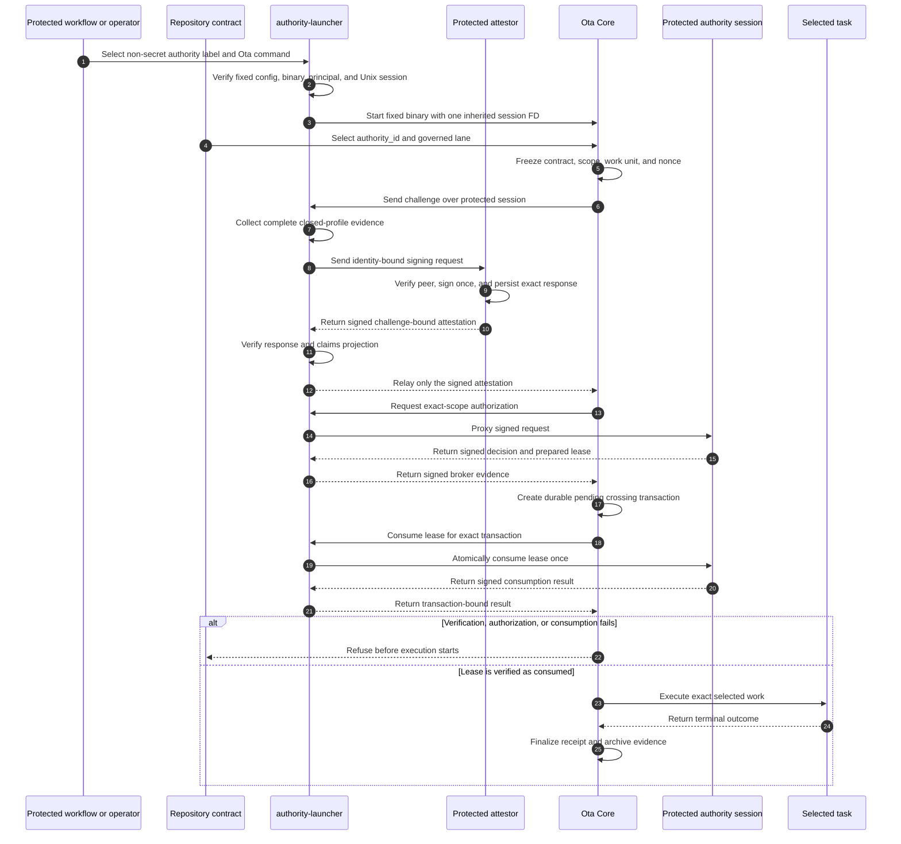

<!--
                █████
               ░░███
       ██████  ███████    ██████
      ███░░███░░░███░    ░░░░░███
     ░███ ░███  ░███      ███████
     ░███ ░███  ░███ ███ ███░░███
     ░░██████   ░░█████ ░░████████
      ░░░░░░     ░░░░░   ░░░░░░░░

   Copyright (C) 2026 — 2026, Ota. All Rights Reserved.

   DO NOT ALTER OR REMOVE COPYRIGHT NOTICES OR THIS FILE HEADER.

   Licensed under the Apache License, Version 2.0. See LICENSE for the full license text.
   You may not use this file except in compliance with the License.
   Unless required by applicable law or agreed to in writing, software distributed under the
   License is distributed on an "AS IS" BASIS, WITHOUT WARRANTIES OR CONDITIONS OF ANY KIND,
   either express or implied. See the License for the specific language governing permissions
   and limitations under the License.

   If you need additional information or have any questions, please email: os@ota.run
-->

# Ota Authority Launcher

Trusted launcher for [Ota](https://github.com/ota-run/ota) crossing authority. It gives Ota a
protected, challenge-bound session for independently authorized work without exposing broker
credentials, signing material, or reusable authority to repository tasks.

> [!IMPORTANT]
> This repository is in early development. It does not yet provide a production-ready launcher,
> hosted authority service, or supported release artifact.

## Current implementation boundary

The first implementation is a Unix session-isolating exec wrapper. It:

- loads launcher configuration only from `/etc/ota/authority-launcher.json`;
- reconciles the selected authority label with Ota's fixed
  `/etc/ota/crossing-brokers.json` binding;
- accepts one already-connected administrator-supplied Unix stream;
- starts one fixed, protected Ota binary as a configured non-root principal;
- gives Ota only its configured session descriptor and marks every other open descriptor
  close-on-exec; and
- proxies the framed Core protocol without interpreting or rewriting signed messages.

The repository now also contains the feature-gated `ota-authority-attestor` foundation. That
separate Linux service owns one systemd-delivered Ed25519 credential, accepts one protected
`SOCK_SEQPACKET` signing request, verifies the live launcher peer, derives producer-owned
freshness, durably records the exact canonical response bytes, and returns the identical response
for an identical unexpired replay. The launcher-side verifier loads only the protected public
producer binding and independently checks the response projection, identity, signature, audience,
key validity, and freshness.

The protected systemd launcher collects the complete ordered
`ota.authority-launcher.systemd/v3` and `ota.authority-job-principal.systemd/v2` observation sets and
invokes that producer. It verifies protected installation identities, exact systemd runtime
properties, process containment, account/sudo/Polkit posture, protected-path and host-socket access,
and Ota process-access denial before relaying the independently verified signed V3 attestation to
Core. Any missing or mismatched observation refuses. This establishes a real local V3 attestation
bridge. It additionally forwards Core's exact
authorization request to one protected, installation-bound local broker proxy, relays only signed
authorization decisions, then relays one exact prepared lease and consumption response. Core keeps
the systemd transaction private and in memory while the launcher journals the full relay and
acknowledges that journal back to Core. After one consumed lease, the launcher retains the exact
child, transient scope, and active-slot journal while selected work runs. Core sends one terminal
transaction-bound completion over the private session; the launcher persists it before
acknowledgement, reconciles the observed child exit, removes the exact scope and empty cgroup,
reaps the child, removes the slot, and only then emits terminal finalization evidence.

The feature-gated `ota-authority-pressure-peer` binary is an exception for conformance testing
only. It uses fixed public test keys and deterministic scenarios to exercise protocol v2 through a
real launcher/Core process chain. The hosted lane runs Core as a dedicated non-root principal with
no supplemental groups, no readable Docker socket, root-only pressure-peer access, protected
authority files, and a strict signed protected-launcher profile. Its scenarios prove live
consumption plus expired, revoked, wrong-scope, already-consumed, unavailable, timed-out,
cancelled, and ambiguous
pre-execution refusal. A paired recovery scenario withholds an already-consumed response, then
proves that a fresh launcher session re-queries the exact durable intent, closes the abandoned
transaction without execution, and requires a newly consumed lease before work starts. The
separate reference-store regression proves atomic one-use state. The pressure peer is not installed
by default and must never be used as an operator broker or authority issuer.

Immediately before signing each challenge, the pressure attestor reconciles the live Ota child
through Linux procfs: all UID/GID slots, supplementary groups, capabilities, `no_new_privs`, the
exact launcher environment, the unnamed close-on-exec Unix session, protected-path access, common
host-control sockets, and measured launcher/configuration identities.

This is bounded conformance evidence for the test launcher boundary. It is not provider attestation,
does not establish host-wide isolation, and does not turn the production launcher into an issuer.

## Why it exists

Some repository operations need more than ordinary task admission. Production deployment,
database migration, package publication, infrastructure mutation, signing, and secret rotation may
require an independently issued authorization that is valid for exactly one verified invocation.

Ota Core derives the exact contract and execution scope, verifies authority, executes the selected
work, and archives bounded evidence. The authority launcher owns the privileged boundary that Core
must not carry in a normal repository process:

- protected broker transport or workload credentials;
- challenge-bound runner or provider attestation;
- delivery of one non-inheritable launcher session to Ota; and
- isolation of authority material from selected task processes.

## Execution model



The launcher does not decide what a repository task means. Ota Core remains the canonical owner of
semantic scope, protocol identities, admission rules, refusal behavior, receipts, and archive
verification.

## Build and invoke

The repository currently supports Rust `1.95.0` on Unix platforms:

```sh
cargo build --release
cargo test --all-targets
cargo clippy --all-targets -- -D warnings
```

The launcher deliberately has no repository-controlled config flag. Its protected configuration
has this initial shape:

```json
{
  "schema_version": 1,
  "ota_binary": "/usr/local/bin/ota",
  "run_as": { "uid": 1001, "gid": 1001 },
  "environment": {
    "HOME": "/home/ota-runner",
    "LANG": "C.UTF-8",
    "LOGNAME": "ota-runner",
    "PATH": "/usr/local/sbin:/usr/local/bin:/usr/sbin:/usr/bin:/sbin:/bin",
    "USER": "ota-runner"
  },
  "sessions": [
    {
      "authority_id": "platform-release-authority",
      "broker_session_descriptor": 4,
      "expected_peer": { "uid": 0, "gid": 0 }
    }
  ]
}
```

The administrator-controlled parent starts the launcher as root and opens the authenticated Unix
stream at descriptor `4`, then executes:

```sh
ota-authority-launcher run \
  --authority-id platform-release-authority \
  -- run publish
```

Only `ota run`, `ota up`, `ota proof runtime`, and `ota proof lifecycle` are accepted. The Ota
binary path, execution principal, complete child environment, source session descriptor, and
Ota-facing descriptor come from protected system configuration, never repository files or
inherited environment variables. The complete Core broker binding format is defined in the
[Broker Crossing Authority reference](https://ota.run/docs/reference/broker-crossing-authority).

## Trust boundary

The launcher is administrator-operated infrastructure outside the repository and job-controlled
filesystem. Repository files, workflow YAML, environment variables, policy packs, and task input
must not select or replace its trust roots, broker credentials, verifier keys, or protected
transport.

Selected task processes must not inherit or reacquire the launcher session. The launcher fails
closed when it cannot establish its local process, descriptor, configuration, or session boundary.
Ota Core verifies signed attestation, freshness, semantic scope, and one-use authorization state.

The target repository declares only an authority identity:

```yaml
governance:
  crossing_authority:
    authority_id: platform-release-authority
```

Administrator-owned protected configuration binds that identity to the launcher and broker. No
usable key, grant, lease, credential, or trust path belongs in `ota.yaml`.

## Systemd service foundation

The Linux `systemd_protected_launcher/v1` service path accepts only
the fixed socket-activated listener, derives the job peer through `SO_PEERCRED`, opens the allowed
repository through the configured execution principal, and prepares the exact protected Ota binary
as a stopped root child. Before fork it creates and fsyncs a root-owned active-slot intent under
`/var/lib/ota/authority-launcher/active`; after fork it atomically binds the request,
working-directory device/inode, principal mapping, PID/start time, binary identity, and complete
child descriptor boundary.

The Linux pressure unit needs root system-manager access and bounded
`CAP_SYS_PTRACE` so it can re-observe protected process and stopped-child descriptor posture. It
binds listening sockets through protected file metadata, descriptor type, socket options, and exact
systemd unit relationships rather than treating `/proc/net/unix` path spelling as authority. These
are bounded adapter requirements, not evidence of provider-attested isolation; the effective unit,
capability, mount, process, and socket posture remain part of the signed hardening profile.

The child receives only standard streams, the systemd profile's fixed private Ota session
descriptor, the fixed binary descriptor, and the retained repository descriptor. Production code
re-observes that exact root/stopped posture and descriptor set before recording the child. It then
asks the root systemd manager for one request-derived transient scope in the fixed invocation slice,
confirms the exact unit properties and sole PID through the kernel cgroup, and durably records that
scope. Only after that persistence does the launcher resume the exact PID through `pidfd`, admit one
bounded `ota_process_posture/v1` frame, and reconcile its identity, PID/start time, Ota binary, and
principal mapping to the prepared child. It then sends one identity-bound local continuation that
binds the exact invocation, child, working directory, posture, and principal mapping so Core can
parse the command and freeze the real semantic scope. The launcher submits Core's exact challenge
plus its complete observed profile to the separately credentialed protected attestor, independently
verifies the returned signature and claims projection, then relays only that signed V3 response. It
reconciles Core's exact matching authorization request, connects only to the protected broker proxy
bound by the installation manifest, consumes one private preface carrying kernel-supplied
`SCM_CREDENTIALS` and `SCM_PIDFD` for the accepting service, and retains that exact process identity
across relay traffic. This distinction is required because PID 1 owns a systemd-activated listener;
`SO_PEERCRED` alone does not identify the service process that accepted the connection. The
launcher then relays signed decisions, the exact prepared lease, and one consumption response back
to Core. Core returns an identity-bound decision acknowledgement and an identity-bound consumption
admission after verifying the launcher's durable relay evidence. The launcher-owned active-slot
journal is the durable authority record; Core's systemd transaction remains private in-memory state.
After consumption, Core may execute the exact selected lane and must return one completion binding
the pending and terminal transaction identities. The launcher persists that completion before
acknowledgement, reconciles the actual child exit, stops the complete scope, confirms it absent and
its cgroup empty or absent, reaps the child, removes the slot, and only then emits terminal
finalization.

On startup, retained journals are reconciled before accepting a client. A valid child- or
scope-bearing temporary journal is promoted rather than discarded. Intent-only state remains a
hard refusal because it cannot establish child absence. An exact pre-scope child is terminated
through Linux `pidfd`; a scope-bearing journal additionally requires the exact unit and kernel
cgroup to be stopped and observed empty. PID reuse, identity mismatch, unsupported cleanup, or any
uncertain outcome retains the slot and fails closed.
This path permits selected execution only after signed V3 admission and one bounded consumed
lease. The selected Ota command creates its ordinary transaction-bound crossing receipt/archive;
launcher terminal evidence separately binds Core's completion to exact child, scope, cgroup, and
slot cleanup. Portable archive reconciliation of that post-process launcher finalization remains a
separate open V11.7 boundary. Only
`ota-authority-attestor` receives the systemd-delivered
signing credential; the launcher retains public verification truth only. Missing, malformed,
oversized, self-inconsistent, or substituted posture, continuation, challenge, attestation, or
authorization decision/admission fails closed and enters the same exact cleanup path. The decision
and selected-execution paths have passed immutable Linux/x64 PID 1 systemd pressure in
[run 31664495937](https://github.com/ota-run/authority-launcher/actions/runs/31664495937),
including completed, failed, interrupted, replay-refused, and crash-recovered execution. The run
does not establish provider-attested separation, and portable Ota archives still do not embed the
launcher-authored post-process finalization.

The feature-gated `ota-authority-systemd-pressure-client` is the unprivileged side of that positive
kernel proof. It connects only to `/run/ota/authority-launcher.sock`, submits one bounded
`LauncherInvocationRequestV1`, streams bounded sequenced output, and accepts only a validated
terminal frame with its caller-selected exact expected stage. Selected-success and selected-failure
controls require identity-bound terminal cleanup evidence. Decision-only compatibility controls can
instead require
`authorization_decision_verified_before_lease_boundary_removed`; negative cases can instead
require exact denied-decision or pre-authorization-protocol refusal;
a posture-only, repository-open, or generic boundary failure cannot satisfy it. Before sending
the request it requires the fixed socket and parent to have the protected root-owned posture and
requires the connected Unix peer to be root-owned. It cannot select another socket, install
configuration, mutate systemd, or provide authority. The binary is not installed
as part of the production launcher.

Immutable crash/recovery pressure may additionally build the launcher with the
`systemd-pressure-faults` feature. In that build only, a root-owned mode-`0600` one-shot marker at
`/run/ota/authority-launcher-pressure-exit-after-scope` terminates the service immediately after
the exact child and scope have been durably journaled. The marker is removed and its parent is
synced before termination. The repository job cannot create the marker; an administrator prepares
it before dispatch. The next socket activation must reconcile and remove that exact boundary
before it can accept another request. Production builds omit the feature and marker behavior.

Hosted normal pressure
[31389237232](https://github.com/bobaikato/create-chrome-extension/actions/runs/31389237232)
and root-armed crash/recovery pressure
[31389713244](https://github.com/bobaikato/create-chrome-extension/actions/runs/31389713244)
bind launcher `d8aa1d0bf9783d29d53d0a5e912f09f1fa414624` to exact reproducible installed
binary identities, unchanged repository state, zero terminal scopes, and the typed post-admission
cleanup stage. The crash run records launcher exit `86` before fresh reconciliation. These runs do
not prove V3 attestation, broker authorization, lease consumption, selected execution, receipt or
archive evidence, or provider-attested separation.

The committed V3 implementation additionally passed local ARM64 OrbStack PID 1 systemd pressure
through the complete protected collector and attestor. Core admitted the signed V3
profile and emitted the exact authorization request; the launcher withheld it, removed the exact
scope/cgroup/child boundary, and finalized the active slot. Protected-installation drift, systemd
runtime drift, and unavailable producer credentials refused with zero selected work. A forced exit
after durable scope recording retained one recovery slot, and the next activation reconciled it to
zero before accepting another request. The checkout sentinel, receipt store, broker decision/lease
state, and terminal scope set remained empty.

Immutable Linux/x64 PID 1 systemd run
[31530832876](https://github.com/ota-run/authority-launcher/actions/runs/31530832876) repeats those
controls against Protocol `574563d1f69a674960d0b3228c5a13b13bc42c19`, Launcher
`c69ad3afc6afef0e260a7eeaa4f7340971db50af`, and clean source-built Core
`31fa95b4d28a8a4971ee3fd65c841d40e54ac4d9`. Its cursor-isolated retained journals prove that
installation drift, runtime-property drift, unavailable producer credentials, and the injected
pre-session crash do not reach authorization. Positive and recovered invocations reach the exact
authorization request, which remains withheld, then finish with the typed
`attestation_admitted_before_authorization_boundary_removed` result. The artifact records one
durable `scope_attached` crash slot, zero terminal slots/scopes, byte-identical repository
manifests, no selected-work or `.ota` state, and only public verifier identity. This closes the
hosted execution-disabled V3 admission gate only; it does not prove broker authorization, lease
consumption, selected execution, crossing receipts/archives, or provider-attested separation.

Immutable Linux/x64 PID 1 systemd run
[31561247605](https://github.com/ota-run/authority-launcher/actions/runs/31561247605) proves the
follow-on signed-decision boundary against exact Protocol
`6a92d8db9d089e44d1980f1871bf6e90eccb9960`, Launcher
`77ab20aa6ed5e3dd42cc6815ba2de7cd36d543bf`, and clean source-built Core
`b71b78ca33ea2edd7bb03ceb66c5e1e104217cd9`. It distinguishes allowed, denied, stale, wrong-scope,
timed-out pending, ambiguous, unavailable-proxy, protected-installation/runtime drift, and missing
credential outcomes while requiring zero terminal active-slot or transient-scope residue.

The pressure peer emits bounded scenario, ordinal, decision, and decision-identity checkpoints. The
launcher verifies the live pidfd-bound broker executable before and after relay traffic, and emits
the complete public relay envelope only under the pressure fault feature and only after durable
active-slot recording. The hosted artifact retains those envelopes together with the public signed
broker responses and broker verifier binding, allowing the signed decision and Core acknowledgement
identities to be re-verified after cleanup without retaining either signing key. Stale and
wrong-scope controls require zero acknowledgements; timeout requires exactly one acknowledged
pending decision; ambiguity requires two signed pending responses but exactly one acknowledgement.
The matrix also crashes after durable scope and allowed-decision recording and requires startup
reconciliation to remove each exact slot, child, cgroup, and scope before a fresh request proceeds.
Artifact inspection independently re-verifies all eight public signed decisions and all five relay
and admission identities. Fourteen complete before/after repository manifests are byte-identical,
and no selected-work, `.ota`, lease, receipt, archive, private-key, or credential residue exists.
This documents an unpressured local foundation only. Immutable Linux/x64 systemd pressure for the
consumed-lease relay, selected execution, crossing receipt/archive evidence, independently
administered provider/launcher separation, and provider attestation remain open.

## What belongs here

- the Unix launcher-session implementation;
- protected credential and broker-session handling;
- challenge-bound attestation collection;
- process and descriptor isolation;
- hardened installation and service definitions;
- protocol conformance and adversarial tests; and
- signed release artifacts, SBOMs, provenance, and operator guidance.

## What does not belong here

- Ota contract parsing or semantic-scope derivation;
- repository-owned authorization or self-issued grants;
- organization approval policy or a hosted approval UI;
- shared signing keys, broker credentials, or production grants;
- a bundled authority-enabled runner image; or
- claims that the launcher governs raw shell execution outside adopted Ota chokepoints.

The authority protocol remains canonically specified and verified by Ota Core. A managed broker,
identity-provider integration, approval workflow, fleet administration, and audit search may be
provided separately; the launcher remains independently inspectable and deployable open-source
infrastructure.

## First milestone

The complete first milestone implements the Unix launcher-session carrier defined by Ota Core:

1. accept one administrator-bound local session;
2. return signed attestation bound to Ota's nonce, scope, and work-unit identity;
3. obtain one exact broker authorization and prepared lease;
4. preserve credentials and the launcher descriptor outside task processes;
5. transparently carry broker-backed atomic one-use consumption and typed refusal; and
6. prove success, replay refusal, expiry, revocation, wrong scope, broker unavailability, bounded
   approval timeout/cancellation/ambiguity, proof-wide transaction finalization, and archive
   reconciliation on a hardened Linux runner.

The proof-wide pressure lane keeps Docker control unavailable to the job principal. Its lifecycle
case uses a deterministic pressure-only Compose control stub to exercise Ota-owned service
selection, assertion ordering, terminal authority, and cleanup. That fixture does not claim Docker
provider behavior; independent provider pressure remains a separate Core evidence boundary.

## Relationship to Ota

- [Ota Core](https://github.com/ota-run/ota) owns the protocol, scope, admission, execution, and
  evidence model.
- [Ota Authority Protocol](https://github.com/ota-run/authority-protocol) publishes the shared
  wire types, fixed domains, framing, identities, and conformance vectors.
- This repository implements the privileged launcher side of that protocol.
- The public operator reference is
  [Broker Crossing Authority (Preview)](https://ota.run/docs/reference/broker-crossing-authority).

## License

Apache License 2.0. See [LICENSE](LICENSE).
